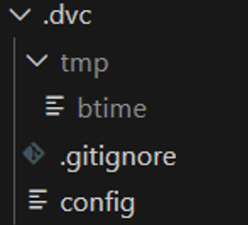
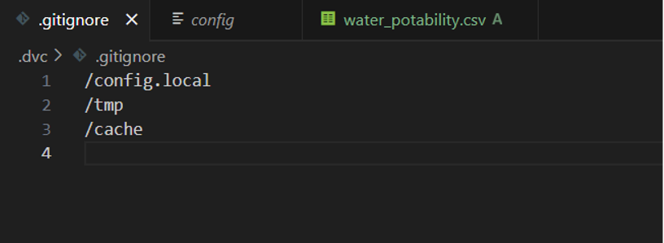
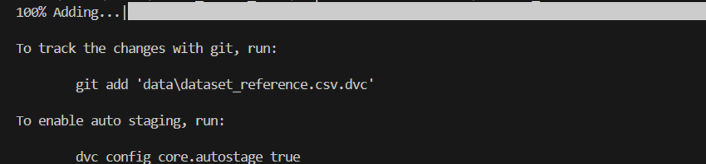
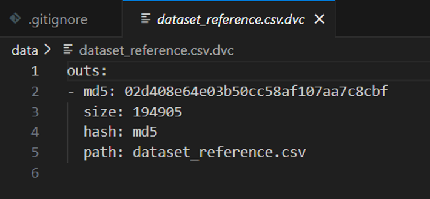
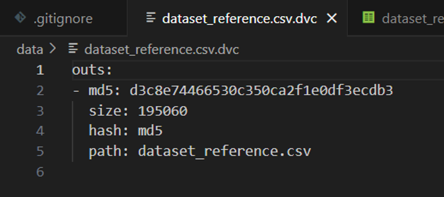

# Data Version Control (DVC)

## Introduction

Versioning is an important aspect of MLOps this for reproducibility. If you have an error which you need to reproduce or when something happens and you have to go back to a previous version you need access to these previous versions. However this does not only apply to code. Your machine learning models and their data also needs to be versioned. Knowing which different forms your data has had and for which machine learning model they were used, can be very useful. Therefore it is important to have a data versioning system in place. You could try to do this with Git but Git is not really made to store large data files or a large number of images. One of the easiest ways to solve this problem is with the use of Data Version Control or [DVC](https://dvc.org/). DVC is an open-source data versioning tool which kind of works like an extension of Git. It allows you to keep track of the different dataset versions and link them to your Git repository. It also works in a similar way to Git, with simple command line commands.
 

## Initialization
First, you have to work in a Git repository. You can create one with the following command.
 
<code>
git init
</code>
  
Similarly, you then can create a DVC repository.
 
<code>
DVC init
</code>
  
This creates several files in a .dvc folder your current directory:

The first one is a .gitignore file. In this file the DVC info you do not want to save in Git is stored. The second more important file is the config file. Here you will write all specific DVC configuration.   

## Adding data to your repository

If you want to add datasets to your DVC repository you can use the following command.
 
<code>
DVC add <i>path/to/data</i>
</code>

This path can be both a file or a directory. When this commando runs it will return something like this.

As mentioned in the terminal response, there should now be an extra file in your directory which has the same name as your saved data but has a .dvc extension. 

When then looking in your .dvc/cash folder, there should now also be a file added with a specific code as name. When you take a look at this file, it should be the same your original dataset. What DVC has done here is create a copy of your original dataset and given it a specific md5 code. This code will be used to save your dataversion in Git. Right now the different versions of the dataset will be saved on your local machine. However, this can also be saved on a [seperate server, S3 bucket or even google Drive](https://dvc.org/doc/user-guide/data-management/remote-storage). 

The next step to actually keep track of your different dataset versions. Add the .dvc file to your Git repository like this. 

<code>
git add <i>path/to/dvc/file</i>  
git commit -m "adding dataset"
</code>
  
The file that was now added to your repository will look something like this.

It contains some information about the dataset you just saved like it's size and path, but most importantly, it contains the md5-code which corresponds to the file name in your dvc cache. 

## Saving data changes

when you are editing the dataset, you should save the changes you made to this dataset. To do this the same steps as saving your original dataset need to be repeated.

<code>
dvc add path/to/changed/dataset
git add <i>path/to/dvc/file</i>  
git commit -m "adding changed dataset"
</code>
  

Now you will see that if you look at the dvc file of the dataset, the md5 code has been changed.

When you then look at your cache in the .dvc folder, you see that there are  two seperate files saved there. When you click on these files you see that the first one is the old version, and the second one is now the new version. In your working directory the only version you can find is your changed dataset file.

## change between data versions

If you want to change between your dataset versions you will have to do two things. The first one is to checkout to your previous git commit.

<code>
git checkout <i>commit name or code</i>

(if you want to know the name of a previous commit)
git log
</code>
  
The second step is to also checkout you DVC repository.

<code>
dvc checkout
</code>
  

When you now look at your dataset in your working directory, it should have changed to the earlier version of your dataset.

## Data on a seperate server
### Local folder

Here we will show how to save the different dataset versions to a seperate server. We start by adding a remote repository for a different folder.

<code>
dvc remote add -d myremote path/to/folder 
</code

If you want to add data to this folder, do not forget to add the <code>--to-remote</code> tag to your <code>dvc add</code> statement.

### SSH
using SSH. You start with adding your remote server with the following command.

<code>
dvc remote add -d myremote ssh://user@example.com:2222/path 
</code>

Next, you can set or modify certain parameters like username, port, private key, or password.

Username and port   
<code>
dvc remote modify myremote user myuser  
dvc remote modify myremote port 2222
</code>
  
Private key   
<code>
dvc remote modify --local myremote keyfile /path/to/keyfile  
(and if needed) dvc remote modify myremote ask_passphrase true   
(or) dvc remote modify --local myremote passphrase mypassphrase
</code>
    
Password  
<code>
dvc remote modify --local myremote password mypassword   
(or) dvc remote modify myremote ask_password true
</code>

# Exercises
With this information you can move on to the preprocessing_images.ipynb and preprocessing_table.ipynb files to clean your datasets. When you do this, save the different versions of your dataset with dvc.