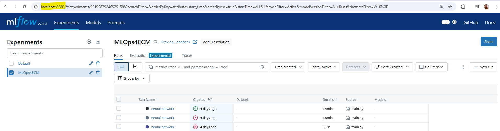
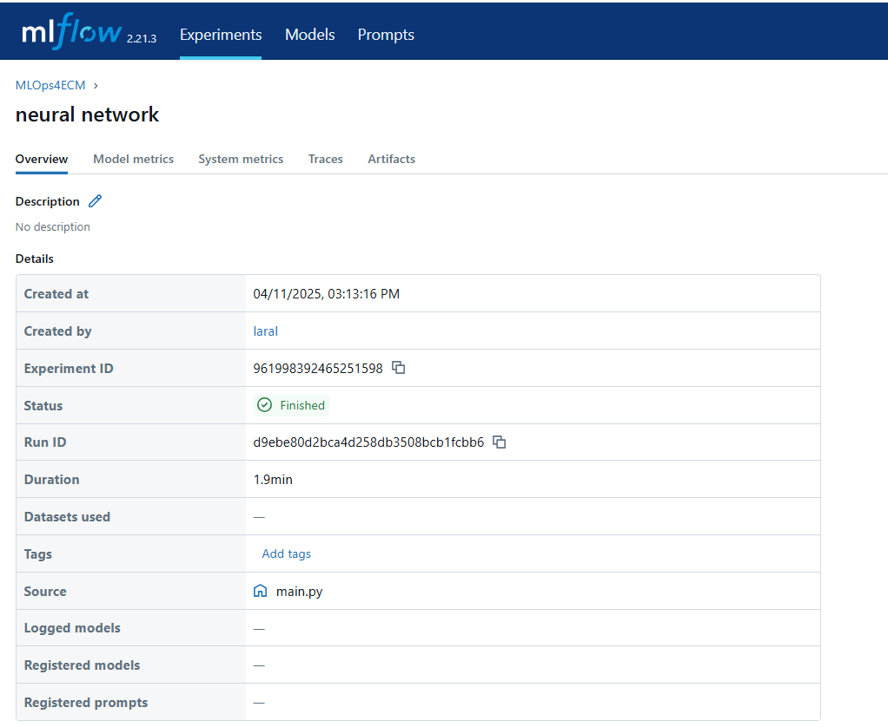
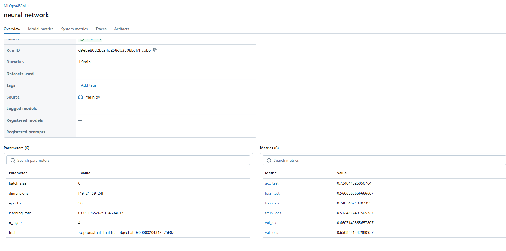
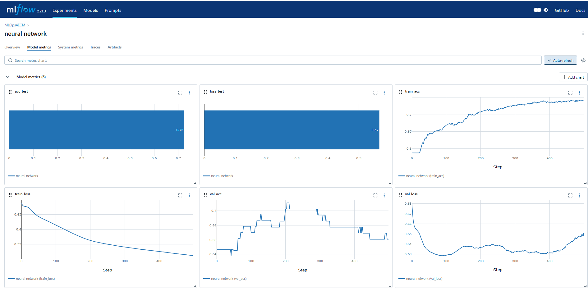
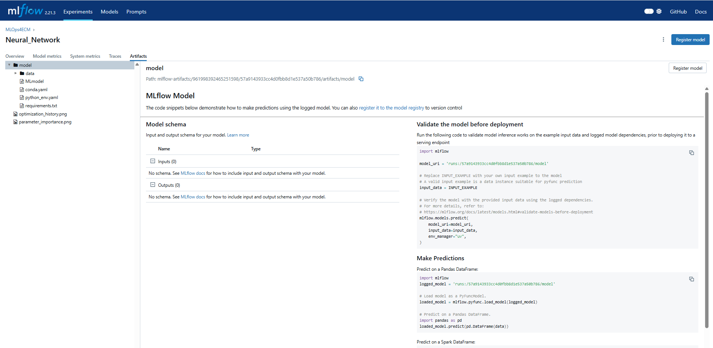

# MLflow implementation

MLflow is a tool used for experiment tracking. It can keep track of your models, its hyperparameters and its metrics, so you can have an overview of all your experiments in one place. You have been given the training process of a neural network using torch. We want to use our water potability dataset to train the model to detect if you can drink the water given certain parameters. The files in cluded are 
* a main.py file which will call all our other functions to train the model.
* A model.py file which contains the definition of our model.
* A predict.py file which contains the function to run the model on a given dataset.
* A train.py file which contains the function to train your machine learning model

At this point, if you run the main.py file you will train your machine learning model with certain hyperparameters and test it on the test set. In the previous exercise with optuna, you made the hyperparmeter search automatic.
 
To add the experiment tracking, we will start in the main.py file.

## imports

```
    import mlflow
    import mlflow.pytorch
```

## Set up mlflow experiment

The first thing you need to do for mlflow is to set a tracking uri. If you want your server to be callable by other machines the URI should be "0.0.0.0:8080"
```
mlflow.set_tracking_uri(uri="http://0.0.0.0:8080")
```

Now that mlflow knows where to send its information we can start an experiment. For this we create a seperate function which checks if an experiment is available with the given name. If not, a new experiment is created. Otherwise, the experiment with the given name is used.

```
def get_or_create_experiment(experiment_name:str):
    if experiment := mlflow.get_experiment_by_name(experiment_name):
      return experiment.experiment_id
    else:
      return mlflow.create_experiment(experiment_name)

# in our objective function
exp_id = get_or_create_experiment("experiment_name")
mlflow.set_experiment(experiment_id=exp_id)
```

MLflow does have an autolog function for certain types of models. However, right now we want to create our own setup. Therefore we disable the autologging for pytorch.

```
mlflow.pytorch.autolog(disable=True)
```
Now we can start with the actual logging of the different variables.

## logging variable

To keep track of the different variables we need to start a run. 

```
 
 with mlflow.start_run(run_name = "run_name"):
        // parameter logging
        // model training
        // model evaluation
        // metric logging
```
Everything we want to log has to be included in this run. This includes the training loop and model evaluation.

Logging the different parameters of your model is pretty easy to do. You just need to make a dictionary of the parameters and then log this to mlflow using the log_params() function.

```
parameters = {
        "batch_size": 20,
        "epochs": 600,
        "learning_rate": 0.15
    }
mlflow.log_params(parameters)
```

Once you have trained and evaluated your model you might want to save the results or metrics, for example your minimum validation loss. This is done in a similar way as saving the model parameters.

```
min_val_loss = train_model(model, data)
accuracy = evaluate_model(model, data)
metrics = {
        "model_accuracy": accuracy,
        "minimum_validation_loss": min_val_loss,
    }
mlflow.log_metrics(metrics)
```

There might be some parameters that you would want to keep track of during the training loop to be able to create graphs in mlflow. For this you can log metrics during the training loop as well. The following code can be used in the train.py file.

```
mlflow.log_metrics({
            "train_loss": train_loss,
            "val_loss": val_loss
        }, step=epoch)
```
Like before we create a dictionary with the metrics we want to save and then we use the log_metrics function. However this time we add the epoch as the step. This way the metric will be saved at each epoch, which will create a graph of the training and validation loss over the training time in mlflow.

## log artifacts

It might be that you want to save a figure that corresponds with your model. This can be a graph or for example a confusion matrix. This can again be easily done using the log_figure() method.

```
fig = plot_figure(data)
mlflow.log_figure(figure=fig, artifact_file="figure_name.png")
```

The artifact file is the file that the artifact (here a figure) well be saved in mlflow. In this case the figure is saved as an png file. Whatch out, mlflow cannot save .html files.

Lastly, you might want to save the model itself. This is done using the log_model function.

```
mlflow.pytorch.log_model(model, "model_name")
artifact_path = "model"
model_uri = mlflow.get_artifact_uri(artifact_path)
```
The last two lines of code save the model to a specific directory in the MLflow experiment.

## The MLflow server

Before we can run our code, our MLflow server needs to be up and running. This can very easily be done in the terminal with the following command.

```
mlflow server --host 0.0.0.0 --port 8080
```
As mentioned before, the host of our server right now is 0.0.0.0 and the port we use is 8080. This should match the variable in the set_tracking_uri() function.

When we run our code, we can go this uri in our browser and view our experiments.


As seen in the image we get an overview of all our different experiments on the left side. When you click on one of your experiments, you find the different runs. You can also see if the run has succesfully finished or if something went wrong on the way (green checkmark vs. red cross).

If you then click on one of the different runs you get the following screen. This includes all the information about your run.


When you scroll down, you see the different metrics and parameters that you saved.



If you then go to the model metrics tab at the top, you get an overview of your saved metrics, including the graphs of the metrics that were saved during training.



Lastly, if you go to the artifacts tab, you van find the different artifacts that you saved. This includes your model and the figures that you saved. As you can see, the model is located in a seperate folder. As you can see in this screenshot, MLflow gives an explenation on how to use your mlflow model for inference. This means that this model can easily be sent to a different person and be tested by them without a lot of coding.



## mlruns and mlartifacts folders

When you start running your experiment you will see that MLflow has created two folder in your directory. These are the mlruns and the mlartifacts folders. There MLflow will keep track of the different runs and artifacts locally. This can be changed if you want to set this up on a specific server. 
