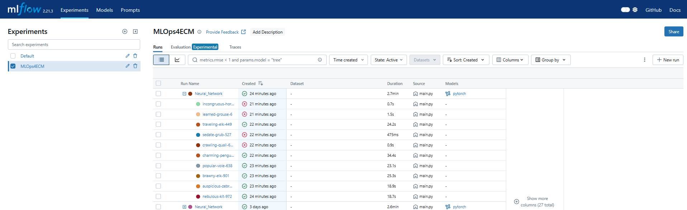

# Combining MLflow and Optuna

When implementing optuna and mlflow together you can get everything working, but running a lot of experiments using optuna can overflow the mlflow server with experiments making it less clear which models are what. Therefore we will implement nested MLflow runs. This means that there will be a main run which will show the best model of our study and underneath this run we have all the seperate runs of the different trials.

## imports

```
    import mlflow
    import mlflow.pytorch
    import optuna
```

## Set up first mlflow experiment

First, in our main function, we set up our tracking uri and experiments in the same way we did it earlier. Then, still in the main function, we start our first mlflow.run(). However, this time we set the nested variable to "True".

```
with mlflow.start_run(experiment_id=exp_id, run_name="main_experiment", nested=True):
    // our main run. with start Optuna study
```

In this main experiment we set up our optuna study. This is very similar to what we did before. However, we add a callback function.

```
study.optimize(hyper_tune_flow, n_trials=10 , callbacks=[champion_callback])
```
Therefore we also have to define this callback function.

```
def champion_callback(study, frozen_trial):
    winner = study.user_attrs.get("winner", None)

    if study.best_value and winner != study.best_value:
        study.set_user_attr("winner", study.best_value)
        if winner:
            improvement_percent = (abs(winner - study.best_value) / study.best_value) * 100
            print(
                f"Trial {frozen_trial.number} achieved value: {frozen_trial.value} with "
                f"{improvement_percent: .4f}% improvement"
            )
        else:
            print(f"Initial trial {frozen_trial.number} achieved value: {frozen_trial.value}")
```
This callback function will make sure that we only log a trial in optuna when that trial surpasses the previous best model. 

In the main MLflow experiment we also want to save the best values and metrics from our optuna study after the study has run. To do this we use the .best_params() and best_metrics parameters from our study variable.

```
best_params = {}
print("best trial: " + str(best_trial.value))
for key, value in best_trial.params.items():
    print("     {}: {}".format(key, value))
    best_params[key] = value

mlflow.log_metric("best_loss", study.best_value)
mlflow.log_params(study.best_params)
```

Afterward you can save the optuna figures to MLflow as a matplotlib plot. However, pay attention, these figures are saved as Matplotlib.axes types. To get the figures themselves you have to do the following:

```
fig = optuna.visualization.matplotlib.plot_optimization_history(study)
mlflow.log_figure(figure=fig.figure, artifact_file="optimization_history.png")
```

To save the best model itself, you need to first save the neural network whilst going trough the loop in a local file. Then, the best model can be called and saved to MLflow using pytorch.save_model().

```
model = NN_model(best_params) # create a new model
best_model_file = "model_file_directory"
model.load_state_dict(torch.load(best_model_file, weights_only=True)) # load the file weights into the new model
mlflow.pytorch.log_model(model, "model")
artifact_path = "model"
model_uri = mlflow.get_artifact_uri(artifact_path)
```
Now everything of the Main experiment is created and we can move on to the MLflow experiments for the trials themselves.

## Second MLflow experiment

This experiment starts at the beginning of your objective function and incorperates everything except for the return statement. We also add a new parameter to our start function: log_system_metric = False. This will make sure that our logging is not overflown with information.

```
with mlflow.start_run(nested=True, log_system_metrics=False)::
        // parameter logging
        // model training
        // model evaluation
        // metric logging
```
Everything we want to log has to be included in this run. This includes the training loop and model evaluation.

Everything else (training, saving parameters and metrics, ...) is the same as we did before.

## MLflow Server

Here is what your MLflow server will look like when we have implemented the nested MLflow experiments. As you can see, there is first our main experiment: "Neural_Network". Next to this experiment there is a +-sign. If you uncollapse this, you find the different trials of the optuna study. Everything else (the metrics and artifacts) is located in the same places as if you did not use nested experiments.




