# Monitoring metrics with prometheus and grafana

In MLOps it is important to monitor different metrics. This includes your machine learning metrics but also metrics of your device and application like CPU usage and memory usage. There are two tools which can make this process easier. These are Prometheus and Grafana. Prometheus is an open-source tool which pools and collects time series data and other metrics. It is used to pull data from different sources. The source that we use is going to be Node exporter, a tool which scrapes the metrics of a linux device, including processing power and storage information. This pulled information is going to be given to Grafana, an open-source dashboarding tool with which we are going to create some dashboards.

## Node exporter

With Node exporter we can create a node which shows all our linux device data. To use it, you first need to download the .tar file from [this website](https://prometheus.io/download/#node_exporter). Next, you simply have to decompress this file and start the node-exporter as follows.

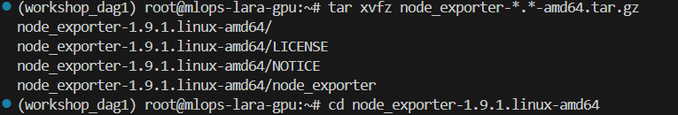
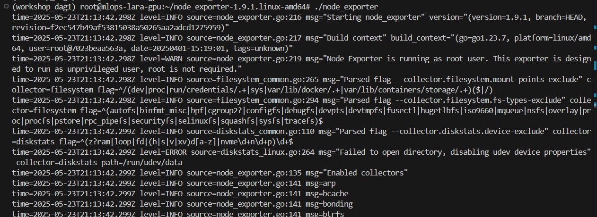

Open a new terminal and test the node exporter using the following command. You can see some of the results above the command in the image of the terminal.

<code>curl http://localhost:9100/metrics | grep "node_"</code>

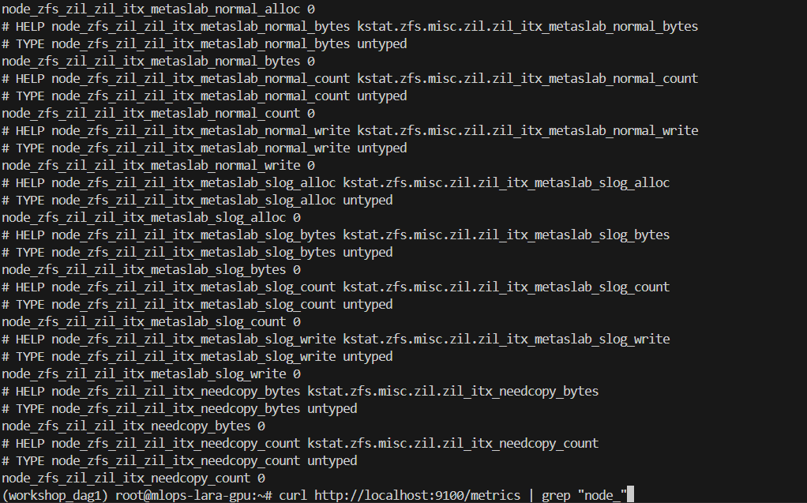

If this succeeds, you can move on to setting up your prometheus server.

##  Prometheus

Now we can download prometheus from the [folling page](https://prometheus.io/download). We have to follow a similar process as with node exporter to decompress the prometheus server. 

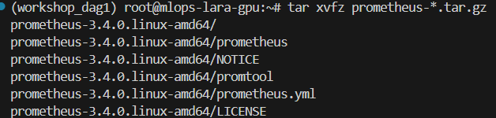
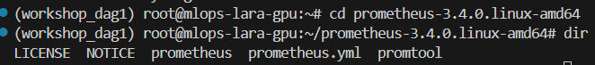

Before we can start the prometheus server, we have to configure the .yml file. This file tells the server where to listen. When you open the file it looks something like this.

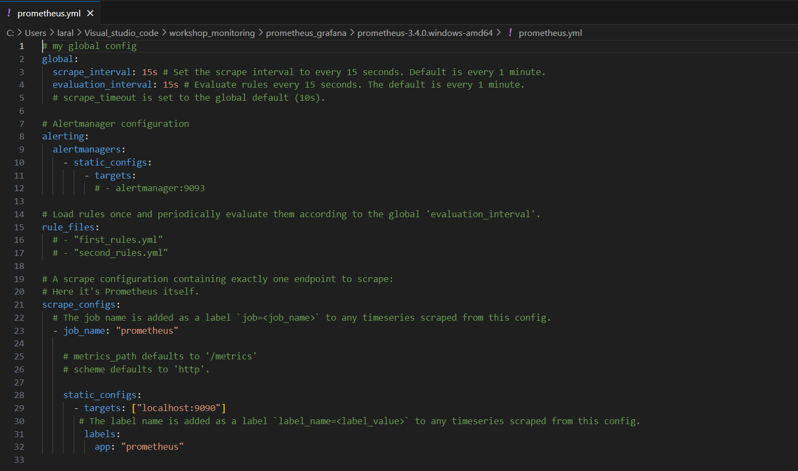

At the top you see the time interval at which the server needs to scrape. You can also see that there are some alerting configuration, however we are not using this for this exercise. At the bottom you see other scraping configurations. This is where we tell the server where to scrape. Right now prometheus is already scraping itself for information. We will now add the node exporter targets as well as some demo targets which are always available on the prometheus website.

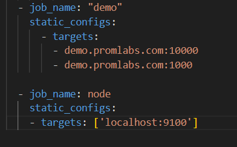

With the .yml file configured, we can start the prometheus server as follows.

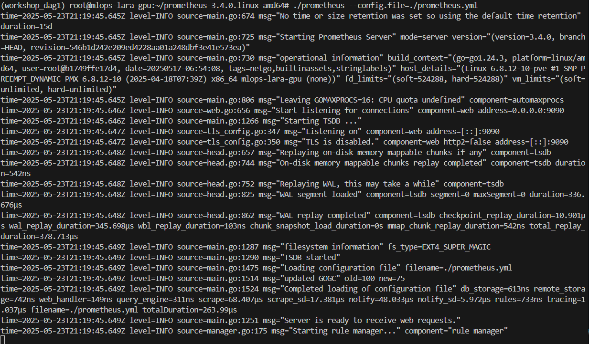

To look at your prometheus server you have to go to the following page.

<code>https://[virtual_machine_IP]:9090</code>

You will see the following page.

On this page you can query the different metrics using the prometheus query language. This can then be shown as both a table and a graph. 

### PromQL

PromQL is the query language Prometheus uses to query the different metrics. A metrics consists of two parts. First is the name of the metric itself. In the example below is this <code>prometheus_http_requests_total</code>. A second part are the labels. These can be set between curly brackets. The five possible labels for the http request metric in the example are given in the dropdown. 

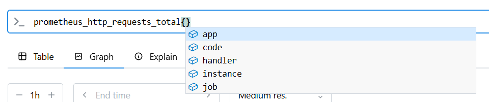
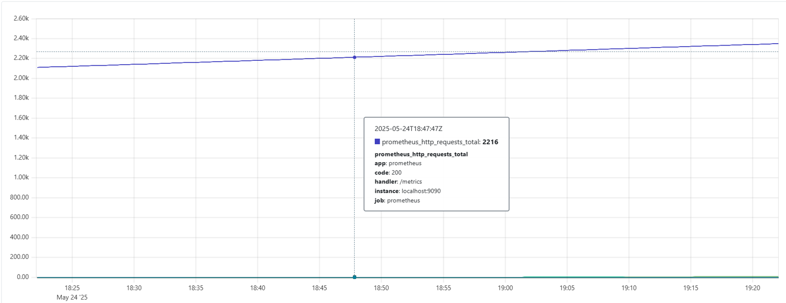

When you run the empty statement you see several graphs. When you hover over these graphs you see the different values corresponding with the labels. In the image we are hovering over the blue graph. This graph corresponds with the "metric" handler. We can also query to show a mectric with a specific label. This label is added in the curly brackets as follows.

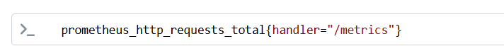
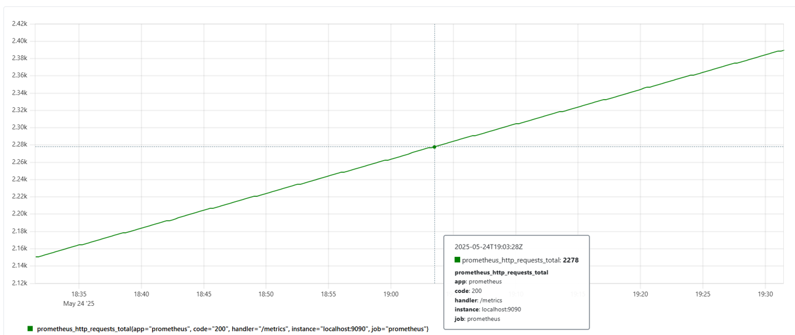

As you can see, now there is only one graph visibla instead of many.

In PromQL there are different types of metrics. The two main ones are gauges which are metrics that can go up and down by a certain amount like the cpu frequency of a device. Another type is the counter. This metric can only go up. However a lot of the time this does not tell us much. Therefore we can use functions like the <code>rate()</code> function which will show the rate per second of a certain counter. You might want to get the rate over the last minute or five minutes (meaning that it looks what the rate is in the last minute or over five minutes for every calculation). This can be done by adding <code>[1m]</code> or <code>[5m]</code> to your statement. An example of this can be seen in the image below

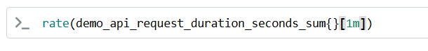
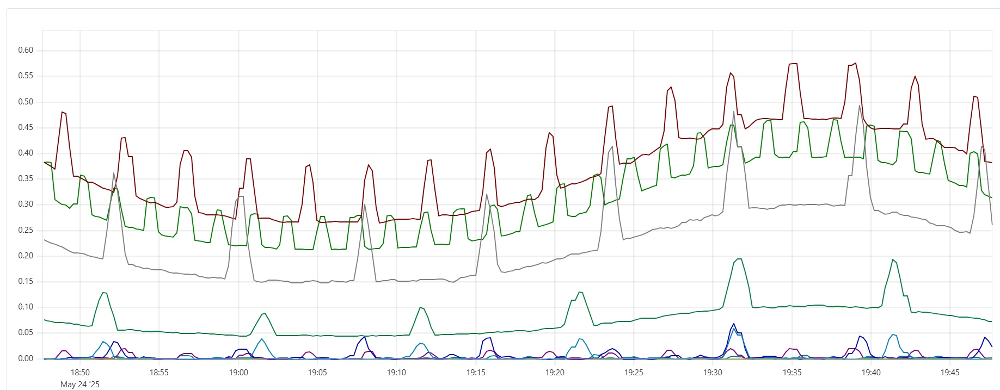

If you want a more detailed explanation of these metrics plus more about the other types of metrics, you can watch [this video](https://www.youtube.com/watch?v=fhx0ehppMGM&list=PLyBW7UHmEXgylLwxdVbrBQJ-fJ_jMvh8h&index=3)

## Grafana

The last step to finish your dashboard is to set up Grafana. You can download it [here](https://grafana.com/grafana/download?pg=get&plcmt=selfmanaged-box1-cta1). There you can find the commands to download it on Linux. Once you have followed these steps you can go to your browser and open the grafana server by typing <code>https://[virtual_machine_IP]:3000</code>. This will show the following page.
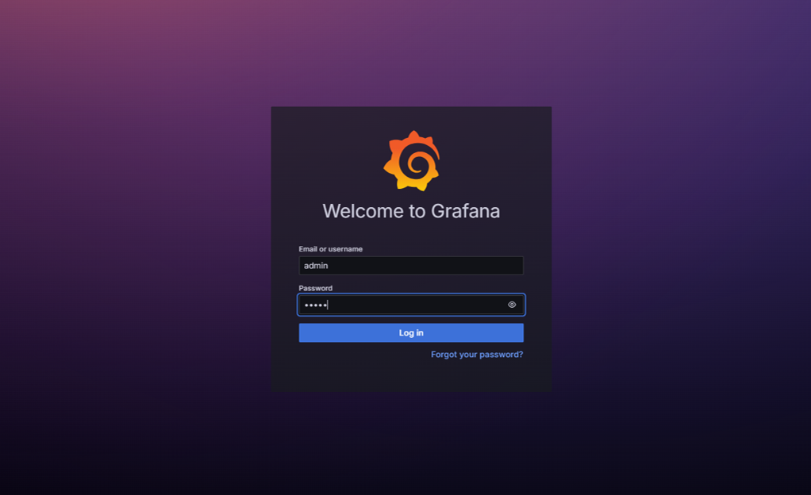
 
Here, you will have to login. The standard user and password are "admin" and "admin". After this Grafana will ask you to add a new login password. When you have done this, you arrive at the following page.

The next step is to add a new connection. Here we will add a connection to Prometheus. First you go to the "connections" tab on the left. Then you will see the following screen. 

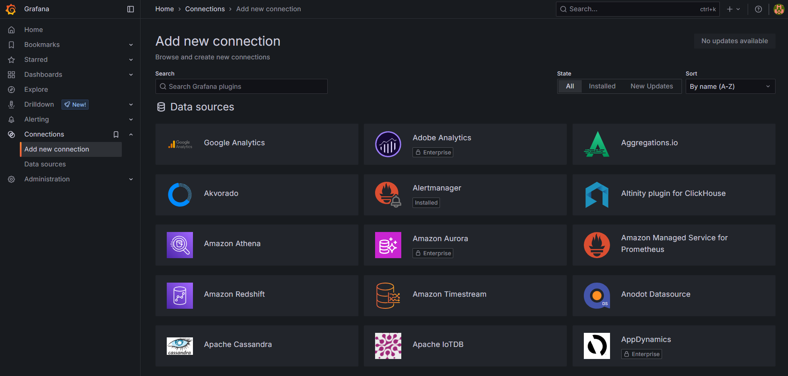

Just search for prometheus and then add the Prometheus data source. This will open the following page.

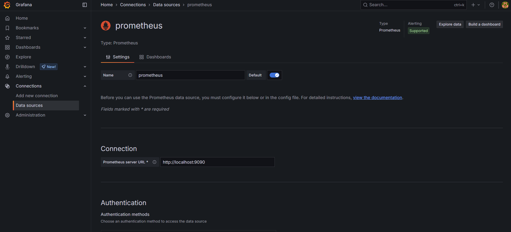

Here you will have to set the IP address of the Prometheus datasource. For us this is <code>http://localhost:9090</code>.

Scroll to the bottom and save your data source. 

Next we will create a new dashboard. Go to the "dashboards" tab on the left. Then click on "create new dashboard".

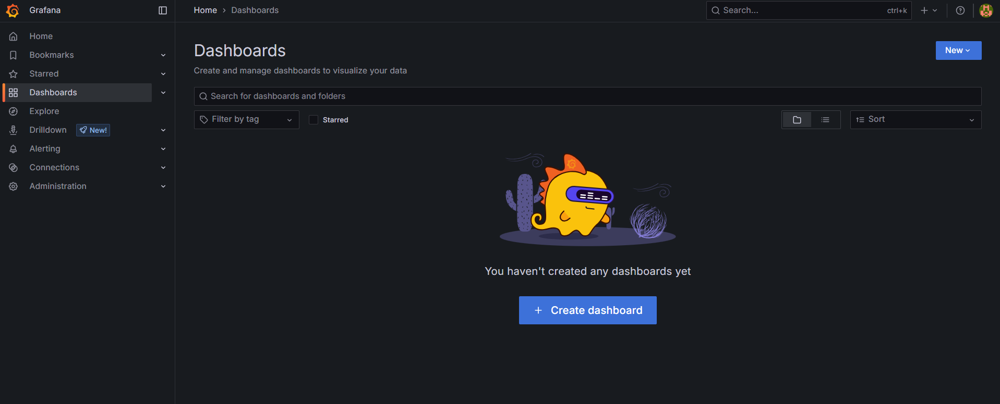

Next, create a new visualization.

At this point you will also have to select the datasource you want to use. Choose the Prometheus connection.

After this, you will see the following screen. In the middel you see the panel that you are creating. Underneath you can select your metric and it's filters. This uses the PromQL language. On the right you can change other settings of your graph like the title, axis, legend, type of graph and units. 

In the image below you can see how you can add the example graph of the demo metric.

This will give the following results.

If you then look at your full dashboard, it looks like this.

Now that you have seen the full process, create your own dashboard using the node exporter metrics (starting with "node_"). Do not be afraid to play around with different graph settings on the right.